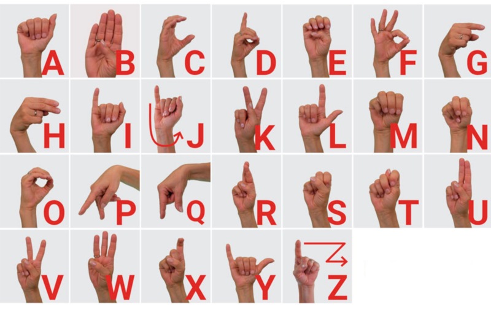

# ASL to Text Generator - Machine Learning Project
This project implements a machine learning model for converting American Sign Language (ASL) signs to word/sentences. Text to speech is also added to read predicted words/sentences.

## Project Overview
This project utilizes computer vision and deep learning techniques to achieve ASL to text conversion. A hand detection and pose estimation model (MediaPipe) extracts features from video frames of ASL signs. These features are then fed into a deep learning model (built with TensorFlow and Keras) to predict the corresponding text. Additionally, the project integrates text-to-speech functionality using the gtts and pygame libraries, allowing the predicted text to be spoken aloud.

## Dependencies
This project requires the following libraries:

scikit-learn 

`pip install scikit-learn`

TensorFlow 

`pip install tensorflow==2.15.0`

Keras

`pip install keras==2.15.0`

Seaborn 

`pip install seaborn`

OpenCV

`pip install opencv-python`

Lime

`pip install lime`

## American Sign language

## ASL Dataset Used
We collected and used our own dataset for this project.
https://drive.google.com/file/d/1tpjjLkuqXWF9RuKMq04YgQhp9UjMcx4D/view
